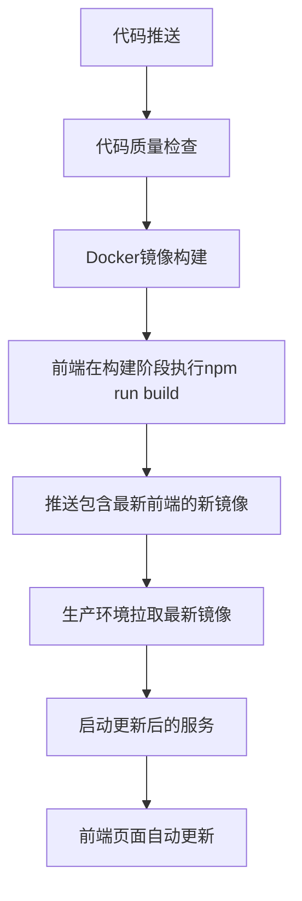

# 前端自动更新部署说明

## 🎯 问题描述
之前的GitHub Actions配置存在一个问题：前端代码更新后，页面没有自动更新到最新版本。

## 🔍 问题根源分析

### 之前的流程缺陷
1. **前端构建验证**只在CI环境中执行
2. **生产环境部署**直接拉取预构建的Docker镜像
3. **镜像更新滞后**导致前端代码变更无法及时生效

### 具体表现
- 本地修改了Vue组件或前端代码
- GitHub Actions成功执行
- 但生产环境的前端页面仍显示旧版本
- 需要手动重新构建和部署

## ✅ 解决方案

### 核心改进
重构GitHub Actions流程，确保每次代码推送都会：

1. **重新构建前端** - 在Docker镜像构建阶段执行
2. **推送最新镜像** - 包含最新前端构建产物
3. **自动部署更新** - 生产环境拉取最新镜像

### 新的部署流程



### 关键配置变更

#### 1. 移除了独立的前端构建验证job
之前的配置：
```yaml
# 移除了这个独立的job
frontend-build-test:
  runs-on: ubuntu-latest
  needs: lint-and-test
  steps:
    - name: Build frontend
      run: cd frontend && npm run build
```

#### 2. 前端构建集成到Docker构建过程
现在的配置：
```yaml
- name: Build and push frontend image
  uses: docker/build-push-action@v5
  with:
    context: ./frontend
    file: ./frontend/Dockerfile
    push: true
    # 前端Dockerfile中包含 npm run build 步骤
```

#### 3. 前端Dockerfile保持不变
```dockerfile
# 构建阶段
FROM node:18-alpine AS build
WORKDIR /app
COPY package*.json ./
RUN npm ci
COPY . .
RUN npm run build  # 👈 关键：每次构建都会执行

# 生产阶段
FROM nginx:alpine
COPY --from=build /app/dist /usr/share/nginx/html  # 👈 复制最新构建产物
```

## 🚀 部署验证

### 自动验证机制
部署脚本中增加了前端更新验证：
```bash
# 验证前端页面更新
echo "🌐 验证前端页面更新..."
sleep 5
# 获取前端构建时间戳进行比较
FRONTEND_BUILD_TIME=$(docker compose exec -T frontend stat -c %y /usr/share/nginx/html/index.html)
echo "前端构建时间: $FRONTEND_BUILD_TIME"
```

### 手动验证方法
使用提供的验证脚本：
```bash
node scripts/verify-frontend-update.js
```

该脚本会检查：
- 本地构建文件时间
- 容器内构建时间
- 前端页面可访问性
- Docker镜像信息
- 容器运行状态

## 📋 验证清单

### 部署前检查
- [ ] 代码已推送到GitHub main分支
- [ ] GitHub Actions workflow已触发
- [ ] 构建阶段无错误

### 部署中监控
- [ ] Docker镜像构建成功
- [ ] 前端build步骤执行完成
- [ ] 新镜像成功推送到registry

### 部署后验证
- [ ] 生产环境成功拉取新镜像
- [ ] 前端容器使用最新构建
- [ ] 页面访问显示最新内容
- [ ] 功能测试通过

## 🛠️ 故障排除

### 常见问题

#### 1. 前端页面未更新
**可能原因**：
- Docker镜像拉取失败
- 容器未正确重启
- 缓存问题

**解决方法**：
```bash
# 在服务器上手动验证
ssh -i "密钥路径" root@服务器IP
cd /root/smart-kitchen
docker compose pull frontend
docker compose up -d frontend
```

#### 2. 构建失败
**可能原因**：
- 前端依赖安装失败
- 构建脚本错误
- 资源不足

**解决方法**：
```bash
# 本地测试构建
cd frontend
npm run build
```

#### 3. 镜像推送失败
**可能原因**：
- Registry认证问题
- 网络连接问题
- 权限不足

**解决方法**：
检查GitHub Actions日志中的认证和推送步骤

## 📚 相关文档
- [GITHUB_ACTIONS_SECURITY_GUIDELINES.md](GITHUB_ACTIONS_SECURITY_GUIDELINES.md) - 安全规范
- [FRONTEND_DEPLOYMENT_BEST_PRACTICES.md](FRONTEND_DEPLOYMENT_BEST_PRACTICES.md) - 部署最佳实践
- [DEPLOYMENT.md](DEPLOYMENT.md) - 完整部署指南

---
**最后更新**: 2026年2月28日
**版本**: v1.1
**状态**: ✅ 已解决并验证