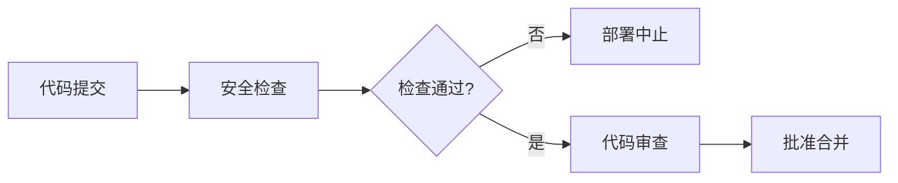
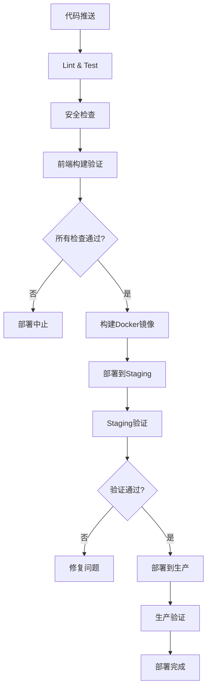

# GitHub Actions 部署安全规范

## 🎯 目标
确保CI/CD流程的安全性，防止生产环境数据丢失和部署失败。

## 🛡️ 核心安全原则

### 1. 数据保护优先
- **绝对禁止**在生产环境部署中自动执行seed脚本
- 部署前必须创建数据状态快照
- 部署后验证数据完整性
- 建立数据变更审批流程

### 2. 环境隔离
- 严格区分开发、测试、生产环境
- 不同环境使用不同的配置文件
- 生产环境部署需要额外审批

### 3. 渐进式部署
- 先部署到staging环境验证
- 通过所有检查后再部署到生产环境
- 支持快速回滚机制

## 🔧 安全检查机制

### 部署前检查 (Pre-deployment)
```yaml
- name: Security check - Verify seed script safety
  run: |
    echo "🔍 检查seed脚本安全性..."
    if grep -r "deleteMany()\|truncate\|drop table" ./backend/prisma/seed.ts 2>/dev/null; then
      echo "❌ 危险操作检测到！seed脚本包含破坏性操作"
      exit 1
    else
      echo "✅ seed脚本安全检查通过"
    fi
```

### 部署中保护 (During deployment)
```bash
# 1. 数据保护检查 - 部署前快照
echo "📸 创建部署前数据快照..."
docker compose exec -T postgres pg_dump -U smart_kitchen smart_kitchen_prod --schema-only > /tmp/db_schema_snapshot_$(date +%Y%m%d_%H%M%S).sql

# 2. 检查当前数据状态
CURRENT_DISH_COUNT=$(docker compose exec -T postgres psql -U smart_kitchen -d smart_kitchen_prod -t -c "SELECT COUNT(*) FROM dishes;")
echo "当前菜品数量: $CURRENT_DISH_COUNT"
```

### 部署后验证 (Post-deployment)
```bash
# 验证数据完整性
NEW_DISH_COUNT=$(docker compose exec -T postgres psql -U smart_kitchen -d smart_kitchen_prod -t -c "SELECT COUNT(*) FROM dishes;")
echo "部署后菜品数量: $NEW_DISH_COUNT"

if [ "$CURRENT_DISH_COUNT" != "0" ] && [ "$NEW_DISH_COUNT" != "$CURRENT_DISH_COUNT" ]; then
  echo "⚠️ 警告: 菜品数量发生变化"
fi
```

## ⚠️ 危险操作黑名单

以下操作在生产环境部署中**严格禁止**：

### Seed脚本中禁止的操作
- `deleteMany()`
- `delete()`
- `truncate`
- `drop table`
- `clear`
- `reset`
- `destroy`

### 数据库迁移中谨慎使用的操作
- `DROP COLUMN`
- `DROP TABLE`
- `ALTER COLUMN` (改变数据类型)
- `DELETE FROM`

## 🔄 安全部署流程

### 1. 代码审查阶段


### 2. CI/CD流水线


### 3. 生产部署步骤
1. **准备阶段**
   - 创建数据快照
   - 记录当前状态
   - 验证环境配置

2. **部署阶段**
   - 安全代码同步
   - 环境变量更新
   - 服务停止和启动
   - 数据库迁移执行

3. **验证阶段**
   - 服务状态检查
   - 数据完整性验证
   - API健康检查
   - 前端页面访问测试

## 🚨 异常处理机制

### 自动化监控
- 服务健康状态监控
- 数据量异常波动检测
- 部署失败自动告警
- 回滚机制触发

### 人工干预点
- 数据显著变化时的人工确认
- 高风险变更的额外审批
- 部署失败时的手动处理
- 紧急情况下的快速回滚

## 📋 检查清单

### 部署前必做事项
- [ ] 代码安全检查通过
- [ ] 前端构建验证成功
- [ ] 所有测试用例通过
- [ ] 环境配置正确
- [ ] 数据备份已完成

### 部署中监控事项
- [ ] 服务启动状态
- [ ] 数据库迁移日志
- [ ] 容器运行状态
- [ ] 资源使用情况

### 部署后验证事项
- [ ] API接口正常响应
- [ ] 前端页面可访问
- [ ] 数据完整性确认
- [ ] 用户功能测试

## 🛠️ 工具和脚本

### 安全检查脚本
- `scripts/pre-deployment-safety-check.js` - 部署前安全检查
- `scripts/post-deployment-verification.js` - 部署后验证

### 自动化脚本
- `scripts/frontend-deploy-update.sh` - 前端更新部署
- `scripts/emergency-data-recovery.js` - 紧急数据恢复

## 📚 相关文档
- [DATA_RECOVERY_REPORT.md](DATA_RECOVERY_REPORT.md) - 数据恢复报告
- [FRONTEND_DEPLOYMENT_BEST_PRACTICES.md](FRONTEND_DEPLOYMENT_BEST_PRACTICES.md) - 前端部署最佳实践
- [DEPLOYMENT.md](DEPLOYMENT.md) - 完整部署指南

---
**最后更新**: 2026年2月28日
**版本**: v1.0
**负责人**: DevOps团队