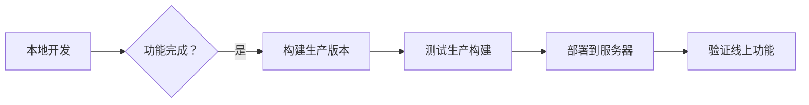

# 本地与生产环境使用指南

## 📋 目录
- [快速开始](#快速开始)
- [环境配置详解](#环境配置详解)
- [常见问题](#常见问题)

---

## 🚀 快速开始

### 本地开发（连接本地后端）

1. **启动本地后端服务**（在 `backend` 目录）：
   ```bash
   cd backend
   npm run dev:backend
   # 或
   npx nest start --watch
   ```

2. **启动前端开发服务器**（在 `frontend` 目录）：
   ```bash
   cd frontend
   npm run dev
   # 或明确指定本地环境
   npm run dev:local
   ```

3. **访问应用**：
   - 前端地址：http://localhost:5173
   - 后端 API：http://localhost:3001

---

### 生产环境（连接服务器后端）

#### 开发模式测试生产环境
```bash
cd frontend
npm run dev:prod
```

#### 构建生产版本并部署
```bash
cd frontend
npm run build:prod
# 构建产物在 dist/ 目录
```

---

## ⚙️ 环境配置详解

### 环境变量文件

| 文件 | API 地址 | 用途 |
|------|----------|------|
| `.env.development` | http://localhost:3001 | 本地开发环境 |
| `.env.production` | http://8.145.34.30:3001 | 生产服务器环境 |
| `.env` | http://localhost:3001 | 默认配置 |

### NPM 脚本说明

#### 开发模式
| 命令 | 环境 | API 地址 |
|------|------|----------|
| `npm run dev` | development (默认) | localhost:3001 |
| `npm run dev:local` | development | localhost:3001 |
| `npm run dev:prod` | production | 8.145.34.30:3001 |

#### 构建模式
| 命令 | 环境 | API 地址 |
|------|------|----------|
| `npm run build` | production (默认) | 8.145.34.30:3001 |
| `npm run build:local` | development | localhost:3001 |
| `npm run build:prod` | production | 8.145.34.30:3001 |

---

## 🔧 自定义后端地址

如需连接其他后端服务器，修改对应环境文件：

```bash
# 示例：连接测试服务器
VITE_API_BASE_URL=http://test-server.com:3001
```

---

## ❓ 常见问题

### Q1: 如何查看当前使用的环境？
打开浏览器开发者工具，在 Console 中输入：
```javascript
import.meta.env.VITE_API_BASE_URL
```

### Q2: 修改环境文件后不生效？
**必须重启开发服务器**才能重新加载环境变量。

### Q3: 如何在开发时调试服务器数据？
```bash
npm run dev:prod
```
这样可以在本地开发模式下连接服务器后端。

### Q4: 构建的产物使用了哪个环境？
- 默认 `npm run build` 使用生产环境
- 构建时环境变量会被固化到代码中
- 无法在运行时切换，需要重新构建

### Q5: 如何同时开发前后端？
**终端 1** - 启动后端：
```bash
cd backend
npm run dev:backend
```

**终端 2** - 启动前端：
```bash
cd frontend
npm run dev
```

---

## 📝 最佳实践

1. **开发时使用本地后端**：响应更快，便于调试
2. **提交前测试生产构建**：确保在生产环境也能正常工作
3. **不要提交敏感信息**：`.env*` 文件应加入 `.gitignore`
4. **使用环境变量管理配置**：避免硬编码地址

---

## 🎯 推荐工作流



---

**最后更新**: 2026-03-03
