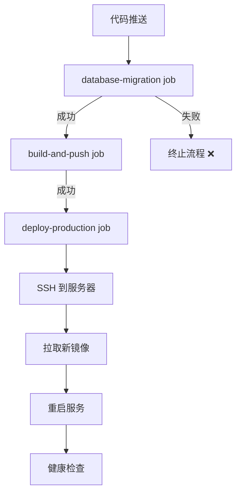

# 数据库迁移分离架构文档

## 📋 概述

本文档说明了智能厨房项目的数据库迁移分离架构，将数据库管理从应用容器中解耦，作为独立的 CI/CD 阶段执行。

## 🎯 核心原则

1. **后端容器不负责 migrate** - 应用容器启动时不执行任何数据库迁移操作
2. **CI/CD 阶段独立执行 migrate** - 在 GitHub Actions 中作为独立 job 运行
3. **先迁移后发布** - 只有数据库迁移成功后，才构建和发布新镜像
4. **幂等性保证** - 所有迁移脚本必须可重复执行

## 🏗️ 架构设计

### 工作流程



### Job 依赖关系

```yaml
jobs:
  database-migration:      # 第 1 步：执行数据库迁移
    runs-on: ubuntu-latest
  
  build-and-push:          # 第 2 步：构建并推送镜像
    needs: database-migration
  
  deploy-production:       # 第 3 步：部署到生产环境
    needs: [database-migration, build-and-push]
```

## 📝 详细实现

### 1. 数据库迁移 Job

**文件**: `.github/workflows/deploy.yml`

```yaml
database-migration:
  runs-on: ubuntu-latest
  environment: production
  steps:
    - name: Checkout Code
      uses: actions/checkout@v4

    - name: Setup Node.js
      uses: actions/setup-node@v4
      with:
        node-version: '25'
        cache: 'npm'

    - name: Install Dependencies
      working-directory: ./backend
      run: npm ci

    - name: Run Prisma Migrate Deploy
      working-directory: ./backend
      env:
        DATABASE_URL: ${{ env.DATABASE_URL }}
      run: npx prisma migrate deploy

    - name: Verify Migration Success
      working-directory: ./backend
      env:
        DATABASE_URL: ${{ env.DATABASE_URL }}
      run: npx prisma db seed || echo "No seed script configured"
```

**关键点**:
- ✅ 使用 Node.js 25 运行 Prisma CLI
- ✅ 通过环境变量传递 DATABASE_URL
- ✅ 迁移失败时自动终止整个 workflow
- ✅ 可选的种子数据步骤（如果配置了 seed 脚本）

### 2. 后端 Dockerfile

**文件**: `backend/Dockerfile`

```dockerfile
# 构建阶段
FROM node:25-alpine AS builder
WORKDIR /app

# 安装依赖
RUN npm ci

# 生成 Prisma Client（仅生成，不迁移）
RUN npx prisma generate

# 编译 TypeScript
RUN npm run build

# 生产阶段
FROM node:25-alpine AS production
WORKDIR /app

# 复制构建产物
COPY --from=builder /app/dist ./dist
COPY --from=builder /app/node_modules ./node_modules
COPY --from=builder /app/prisma ./prisma

# 直接启动应用，不执行 migrate
CMD ["node", "dist/src/main.js"]
```

**关键点**:
- ✅ 只生成 Prisma Client，不执行 migrate
- ✅ 启动命令直接运行应用代码
- ✅ 容器内包含 migrations 目录用于参考

### 3. 部署脚本

**文件**: `.github/workflows/deploy.yml` (deploy-production job)

```bash
# 停止旧服务
docker compose down --remove-orphans

# 拉取新镜像
docker compose pull --policy always

# 启动新服务（不再执行 migrate）
docker compose up -d

# 健康检查
curl -f http://localhost:3001/api/health
```

**移除的步骤**:
- ❌ ~~`docker compose run backend npx prisma migrate deploy`~~
- ❌ ~~等待数据库就绪的额外步骤~~

## 🔄 完整部署流程

### 正常流程

1. **开发者推送代码** → `git push origin main`
2. **GitHub Actions 触发**
   - Job 1: 执行 `prisma migrate deploy`
     - ✅ 成功 → 继续
     - ❌ 失败 → 终止，不发布有问题的镜像
   - Job 2: 构建前后端镜像并推送
   - Job 3: SSH 到服务器，拉取新镜像，重启服务
3. **服务自动更新** - 新代码开始处理请求

### 迁移失败场景

```
推送代码 
  ↓
database-migration job 开始运行
  ↓
npx prisma migrate deploy 失败
  ↓
❌ Workflow 终止
❌ 不执行 build-and-push
❌ 不执行 deploy-production
✅ 已运行的服务不受影响
```

### 回滚流程

如果需要回滚数据库迁移：

```bash
# 1. 本地执行回滚
npx prisma migrate resolve --rolled-back <migration_name>

# 2. 提交回滚迁移
git add .
git commit -m "Rollback problematic migration"
git push

# 3. CI/CD 会自动执行回滚后的状态
```

## 📊 优势对比

### 旧方案（容器启动时 migrate）

```yaml
services:
  backend:
    command: >
      sh -c "npx prisma migrate deploy && node dist/main.js"
```

**问题**:
- ❌ 启动时间长（每次都要检查迁移）
- ❌ 多实例并发风险（多个容器同时 migrate）
- ❌ 迁移失败导致容器无法启动
- ❌ 难以追踪迁移历史
- ❌ 日志混杂（迁移日志 + 应用日志）

### 新方案（CI/CD 阶段 migrate）

```yaml
jobs:
  database-migration:
    run: npx prisma migrate deploy
```

**优势**:
- ✅ 快速启动（容器直接运行应用）
- ✅ 单次执行（避免并发问题）
- ✅ 迁移失败不影响已运行服务
- ✅ 清晰的版本控制
- ✅ 分离的日志记录
- ✅ 符合 GitOps 最佳实践

## 🔧 本地开发

### 开发环境迁移

```bash
# 1. 开发时创建新迁移
npx prisma migrate dev --name add_new_field

# 2. 查看迁移文件
ls backend/prisma/migrations/

# 3. 测试迁移
npx prisma migrate deploy

# 4. 重置数据库（如需）
npx prisma migrate reset
```

### 生产环境验证

```bash
# 查看迁移状态
npx prisma migrate status

# 验证数据库 schema
npx prisma db pull

# 生成最新的 Prisma Client
npx prisma generate
```

## 🚨 故障排查

### 迁移失败

**症状**: `database-migration` job 失败

**解决步骤**:
1. 检查 GitHub Actions 日志
2. 查看具体错误信息（外键约束、字段类型等）
3. 本地复现：`npx prisma migrate deploy`
4. 修复 schema 或 migration 文件
5. 重新推送代码

### 迁移成功但应用报错

**可能原因**:
- Prisma Client 未更新
- 代码中的模型定义与数据库不一致

**解决方案**:
```bash
# 重新生成 Prisma Client
npx prisma generate

# 重新构建后端镜像
docker build -t backend:latest ./backend

# 测试验证
```

### 跳过迁移（紧急情况）

⚠️ **仅在紧急情况下使用**

```yaml
# 临时注释掉 migration job
# database-migration:
#   ...

build-and-push:
  # needs: database-migration  # 临时移除依赖
  ...
```

## 📚 相关文档

- [Prisma Migrate 官方文档](https://www.prisma.io/docs/guides/database/developing-with-prisma-migrate)
- [GitHub Actions 工作流语法](https://docs.github.com/en/actions/using-workflows/workflow-syntax-for-github-actions)
- [Docker Compose 最佳实践](https://docs.docker.com/compose/best-practices/)
- [GitOps 部署模式](https://opengitops.dev/)

## 🎯 总结

通过将数据库迁移从应用容器中分离，我们实现了：

1. ✅ **更快的容器启动** - 无需每次启动都检查迁移
2. ✅ **更高的可靠性** - 避免并发迁移风险
3. ✅ **更好的可观测性** - 迁移日志独立记录
4. ✅ **更安全的部署** - 迁移失败不影响运行服务
5. ✅ **符合云原生实践** - 遵循 GitOps 和不可变基础设施原则

---

**最后更新**: 2026-03-03  
**维护者**: Smart Kitchen Team
