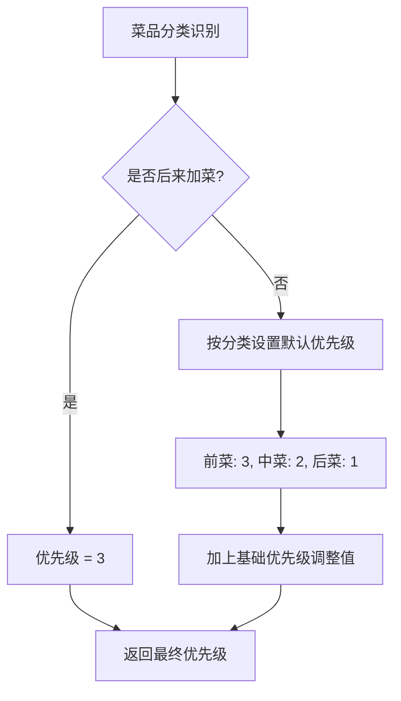
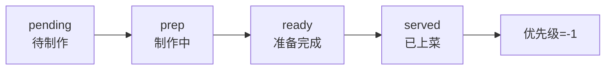
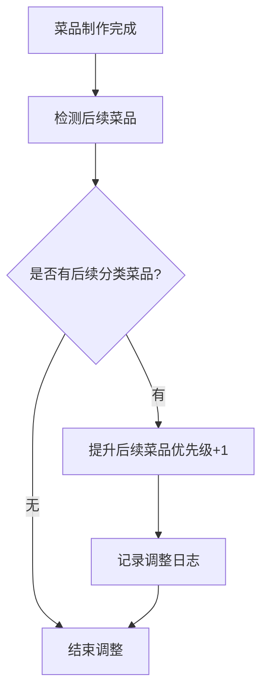

# 智能厨房出餐逻辑系统架构文档

## 🏗️ 系统整体架构

```
┌─────────────────────────────────────────────────────────────┐
│                    智能厨房出餐逻辑系统                      │
├─────────────────────────────────────────────────────────────┤
│  🎨 前端展示层 (Vue3 + Ant Design Vue)                      │
│  ├─ ServingOverview.vue     # 总览视图                      │
│  ├─ OrderEntryForm.vue      # 订单录入                      │
│  ├─ serving.js             # 状态管理(Pinia)                │
│  └─ WebSocket连接          # 实时数据推送                   │
├─────────────────────────────────────────────────────────────┤
│  🔧 后端服务层 (NestJS + RESTful API)                       │
│  ├─ ServingController      # API控制器                      │
│  ├─ ServingService         # 业务逻辑服务                   │
│  ├─ PrismaService          # 数据库访问                     │
│  └─ WebSocket网关          # 实时通信                       │
├─────────────────────────────────────────────────────────────┤
│  🗄️ 数据库层 (PostgreSQL)                                   │
│  ├─ 核心函数                                               │
│  │  ├─ calculate_dish_priority_mvp()  # 优先级计算         │
│  │  ├─ auto_adjust_priorities_for_order() # 自动调整       │
│  │  ├─ complete_dish_prep_mvp()       # 制作完成           │
│  │  └─ serve_dish_mvp()               # 上菜处理           │
│  ├─ 视图                                                   │
│  │  ├─ dish_serving_order_mvp         # 出餐顺序           │
│  │  ├─ order_item_serving_status_mvp  # 状态视图           │
│  │  └─ serving_alerts_mvp             # 提醒视图           │
│  └─ 触发器                                                 │
│     └─ 自动优先级调整触发器                                │
└─────────────────────────────────────────────────────────────┘
```

## 🔄 核心业务流程

### 1. 出餐优先级计算流程



### 2. 订单处理状态流转



### 3. 自动优先级调整机制



## 🎯 核心算法实现

### 优先级计算算法

```javascript
function calculateDishPriority(categoryName, isAddedLater, basePriority) {
    // 后来加菜特殊处理
    if (isAddedLater) return 3;
    
    // 分类优先级映射
    const priorityMap = {
        '前菜': 3,    // 红色催菜
        '中菜': 2,    // 黄色等待
        '后菜': 1,    // 绿色不急
        '尾菜': 1,    // 绿色不急
        '凉菜': 3,    // MVP按前菜处理
        '点心': 2,    // MVP按中菜处理
        '蒸菜': 2     // MVP按中菜处理
    };
    
    const basePriority = priorityMap[categoryName] || 0;
    return basePriority + basePriority;
}
```

### 出餐顺序算法

```sql
-- 出餐顺序配置
SELECT 
    category_name,
    CASE category_name
        WHEN '前菜' THEN 1
        WHEN '中菜' THEN 2
        WHEN '后菜' THEN 3
        WHEN '尾菜' THEN 4
        ELSE 5
    END as serving_sequence,
    calculate_dish_priority_mvp(category_name, false, 0) as priority
FROM dish_categories
ORDER BY serving_sequence;
```

## 📊 数据流向图

### 实时数据更新流程

```
用户操作 → 前端组件 → API调用 → 后端服务 → 数据库更新
    ↑                                                    ↓
    └────────────── WebSocket推送 ←─────────────────────┘
```

### 提醒机制流程

```
定时任务 → 检测紧急菜品 → 生成提醒 → 推送前端 → 用户处理
```

## 🔧 系统组件详解

### 1. 数据库组件

**核心函数模块** (`serving-logic-mvp.sql`)：
- `calculate_dish_priority_mvp()`: 优先级计算核心函数
- `auto_adjust_priorities_for_order()`: 自动优先级调整
- `complete_dish_prep_mvp()`: 制作完成处理
- `serve_dish_mvp()`: 上菜处理函数
- `detect_urgent_dishes()`: 紧急菜品检测

**视图模块**：
- `dish_serving_order_mvp`: 出餐顺序标准化视图
- `order_item_serving_status_mvp`: 订单菜品实时状态
- `serving_alerts_mvp`: 智能提醒生成视图

### 2. 后端组件

**服务层** (`ServingService`)：
```typescript
class ServingService {
    // 核心业务方法
    getOrderServingStatus(orderId: number)
    updateItemPriority(itemId: number, priority: number, reason?: string)
    completeDishPreparation(itemId: number)
    serveDish(itemId: number)
    autoAdjustOrderPriorities(orderId: number)
    getServingAlerts()
    detectUrgentDishes()
}
```

**控制器层** (`ServingController`)：
```typescript
@Controller('serving')
class ServingController {
    @Get('orders/:orderId/status')
    @Put('items/:itemId/priority')
    @Post('items/:itemId/complete-prep')
    @Post('items/:itemId/serve')
    @Post('orders/:orderId/auto-adjust')
    @Get('alerts')
    @Get('urgent-dishes')
}
```

### 3. 前端组件

**总览视图** (`ServingOverview.vue`)：
- 双列卡片展示系统
- 颜色编码状态显示
- 右键菜单操作
- 实时数据更新

**状态管理** (`serving.js`)：
```javascript
const useServingStore = defineStore('serving', {
    state: { orders: [], alerts: {} },
    getters: { 
        urgentOrders, 
        dishesByPriority, 
        statistics 
    },
    actions: {
        loadOrders(),
        updateItemPriority(),
        completePreparation(),
        serveDish()
    }
});
```

## 🚀 部署架构

### 生产环境部署

```
┌─────────────────┐    ┌─────────────────┐    ┌─────────────────┐
│   Load Balancer │────│    Web Server   │────│   Application   │
│   (Nginx)       │    │   (Nginx/Vue)   │    │   (NestJS)      │
└─────────────────┘    └─────────────────┘    └─────────────────┘
                                │
                        ┌───────┴───────┐
                        │               │
                ┌─────────┐      ┌─────────┐
                │Database │      │   Redis │
                │(PostgreSQL)│   │(缓存)   │
                └─────────┘      └─────────┘
```

### 开发环境配置

```yaml
# docker-compose.yml
version: '3.8'
services:
  postgres:
    image: postgres:15
    environment:
      POSTGRES_DB: smart_kitchen_dev
      POSTGRES_USER: postgres
      POSTGRES_PASSWORD: postgres
    
  backend:
    build: ./backend
    ports:
      - "3000:3000"
    depends_on:
      - postgres
      
  frontend:
    build: ./frontend
    ports:
      - "8080:80"
    depends_on:
      - backend
```

## 🔒 安全架构

### 认证授权体系
```
JWT Token → API Gateway → Service Validation → Database Access
```

### 数据安全措施
- 数据库连接加密
- API请求验证
- 输入参数过滤
- SQL注入防护
- XSS攻击防护

## 📈 性能优化策略

### 数据库优化
- 关键字段索引优化
- 视图预计算
- 存储过程缓存
- 连接池管理

### 前端优化
- 组件懒加载
- 虚拟滚动
- 防抖节流
- 本地缓存

### 后端优化
- API响应缓存
- 数据库查询优化
- 异步处理
- 负载均衡

## 📊 监控告警体系

### 关键指标监控
- 系统响应时间
- 数据库查询性能
- API调用成功率
- 用户并发数
- 错误率统计

### 告警机制
- 性能阈值告警
- 系统异常告警
- 业务指标告警
- 安全事件告警

## 🛠️ 运维管理

### 日志管理
```
应用日志 → 日志收集 → 日志分析 → 告警通知
```

### 备份策略
- 数据库定期备份
- 代码版本控制
- 配置文件备份
- 灾难恢复预案

### 升级维护
- 灰度发布
- 滚动更新
- 回滚机制
- 版本兼容性

---
**架构版本**: v1.0.0  
**更新时间**: 2026年  
**适用范围**: MVP生产环境